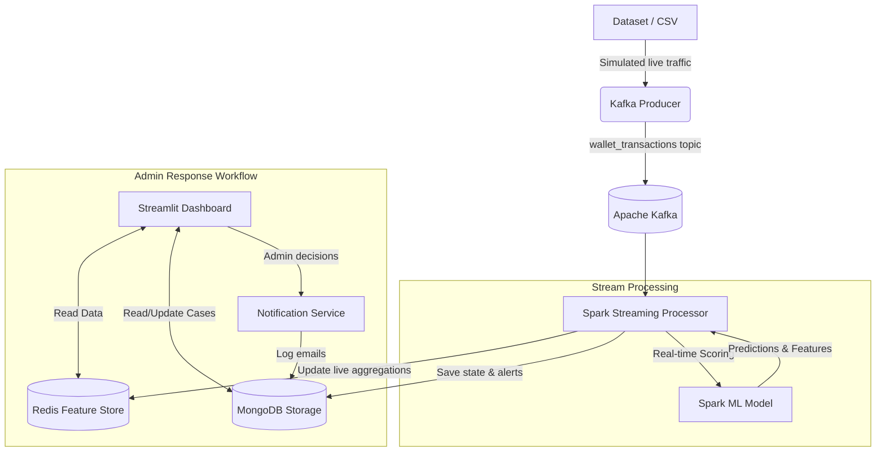

# 🛡️ Real-Time Fraud Detection System

A complete, real-time fraud detection pipeline for digital wallet transactions using **Kafka**, **Apache Spark**, **Redis**, **MongoDB**, and **Streamlit**.

This system handles end-to-end processing: ingesting live transactions, scoring them with a Machine Learning model in real-time, storing features/results, and providing an Admin Control Panel for case review and response operations.

---

## 🏗️ System Architecture

The architecture is designed for high-throughput, low-latency streaming data processing with a human-in-the-loop admin panel.



### 1. Ingestion (Kafka Producer)
Simulates real-world traffic by reading `data/streaming_data.csv` and publishing transactions line-by-line to a Kafka topic (`wallet_transactions`). It introduces realistic delays to mimic live application traffic.

### 2. Stream Processing (PySpark)
A Spark Structured Streaming job consumes messages from Kafka. It parses the JSON, applies the exact same feature engineering used during model training, and generates a `fraud_probability`.
- **Auto-Triage**: If `probability > 0.90`, it flags the transaction as `PENDING_BLOCK`. If `probability > 0.35` but `< 0.90`, it flags it as `PENDING_REVIEW`.
- **Storage**: Real-time stats, velocity metrics, and user profiles are updated in **Redis** (for <10ms latency). The raw transaction, ML prediction, and case status are persisted in **MongoDB**.

### 3. Response Workflow & Case Management
An admin-driven Streamlit dashboard with 3 pages:
1. **Monitor**: Real-time KPIs, live transaction feed, alert ticker, and volume/channel analytics.
2. **Case Management**: Provides a table of pending cases with a model-generated **Reason** (e.g., "High amount; New device; High risk score"). Admins can **Block & Notify**, **Send Alert**, or **Dismiss**.
3. **Reports**: Generates a downloadable text summary of system health and exports data to CSV.

---

## 🧠 ML Algorithm & Training Methods

The core intelligence of the system is a **Logistic Regression** model built with Spark MLlib. 

### Why Logistic Regression?
We chose Logistic Regression because it provides **calibrated probabilities** (not just a 1/0 prediction), which is crucial for our triage system (`>0.90` vs `>0.35`). It is also highly interpretable and extremely fast for real-time inference on streaming data.

### Feature Engineering
The model transforms raw data into 16 engineered features:
- **Categorical Handling**: String variables (like `channel`, `device_os`) are processed using `StringIndexer` and `OneHotEncoder`.
- **Numerical Scaling**: Amount, user account age, and velocity metrics are normalized using `VectorAssembler` and `StandardScaler` to prevent high-value transactions from dominating the model weights.
- **Derived Features**: Includes `corridor_risk` (source-to-destination country risk), `txn_velocity_1h`, and `device_trust_score`.

### Training Methodology
1. **Resampling / Class Balancing**: Fraud datasets are highly imbalanced. The model trains on a dataset containing ~9.5% fraud.
2. **Regularization**: `regParam` is set to `0.03` (L2/Ridge regularization) to prevent overfitting on the highly correlated feature vectors while allowing the model to detect subtle fraud patterns. 
3. **Threshold Tuning**: The default classification threshold of `0.5` causes the model to be too conservative. We lowered the threshold to `0.35` to increase **Fraud Recall** (catching more fraud) while maintaining an acceptable level of **Precision** (avoiding false alarms).

### Current Model Performance
*Evaluated on an ultra-realistic, highly deceptive dataset balancing obvious and stealthy fraud.*
- **AUC-ROC**: `0.8710`
- **Fraud Precision**: `93.70%` *(When it flags fraud, it's almost certainly fraud)*
- **Fraud Recall**: `56.13%` *(Catches the majority of fraud, prioritizing strict accuracy over broad sweeps)*

---

## 🚀 Setup & Execution

The entire system is containerized. No local dependencies (like Java or Spark) are required other than Docker.

### Prerequisites
- [Docker](https://docs.docker.com/get-docker/)
- [Docker Compose](https://docs.docker.com/compose/install/)

### Quick Start (Local Docker)

1. **Clone the repository**
   ```bash
   git clone https://github.com/thmthu4/Fraud_Detection_System.git
   cd Fraud_Detection_System
   ```

2. **Start the Infrastructure**
   ```bash
   # Starts Zookeeper, Kafka, Redis, and MongoDB in the background
   docker-compose up -d zookeeper kafka redis mongodb
   ```

3. **Run the Full Pipeline**
   We provide a wrapper script to handle Python environments, model training, streaming, and the dashboard.
   ```bash
   # It will automatically train the model (if missing), start the producer, 
   # start Spark streaming, and launch the Streamlit frontend.
   ./scripts/run_pipeline.sh data/dataset.csv
   ```
   *Note: If you want to force the system to retrain the ML model from scratch, append `--retrain` to the command above.*

4. **Open the Dashboard**
   Navigate to [**http://localhost:8501**](http://localhost:8501) in your browser.

### Shutting Down

To shut down gracefully, simply hit `Ctrl+C` in the terminal where the pipeline is running. Then, to spin down the Docker containers:
```bash
docker-compose down           # Stop containers
docker-compose down -v        # Stop containers AND wipe all database data
```

---

## 📂 Project Structure

```
├── config/              # Central variables and MongoDB/Redis connection URIs
├── dashboard/           # Streamlit Frontend
│   ├── app.py           # Main Monitor Page
│   └── pages/           # Case Management and Report sections
├── data/                # Datasets for training and streaming
├── database/            # MongoDB interface and case management wrappers
├── feature_store/       # Redis interface for stateful streaming metrics
├── kafka_producer/      # Simulates live traffic by pushing to Kafka
├── model_training/      # Spark ML pipelines (train_model.py, evaluate_model.py)
├── notifications/       # Simulated Email Notice logic (stores to Mongo)
├── scripts/             # Bash automation for Docker and Pipeline
├── spark_streaming/     # PySpark Structured Streaming consumer (stream_processor.py)
├── docker-compose.yml   # Infrastructure definitions
├── Dockerfile           # Python 3.12 + OpenJDK 21 environment
└── requirements.txt     # Python dependencies
```

---

## 🛠️ Technology Stack

| Component | Technology | Use Case |
|-----------|-----------|----------|
| **Ingestion** | Apache Kafka | High-throughput, fault-tolerant message queue |
| **Stream Compute** | Apache Spark | Micro-batch structured streaming engine |
| **Machine Learning** | PySpark MLlib | Logistic Regression, Vector Assembly |
| **Feature Store** | Redis | Low-latency state, counters, velocity aggregations |
| **Database** | MongoDB | Permanent storage for transactions, notifications, cases |
| **Frontend** | Streamlit | Rapid UI development for Admin Control Panel |
| **Deployment** | Docker | Containerized infrastructure and isolated app runtimes |
